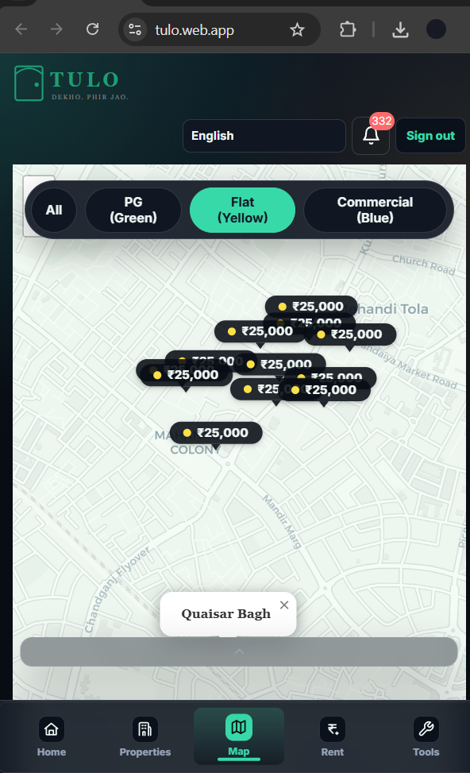
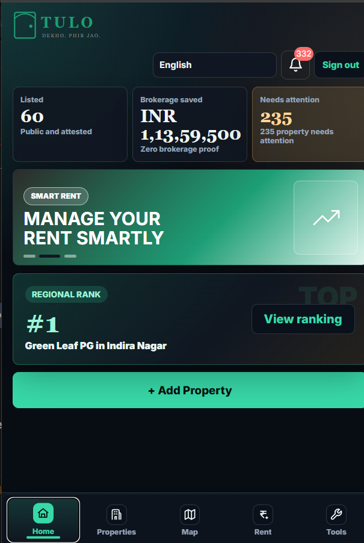
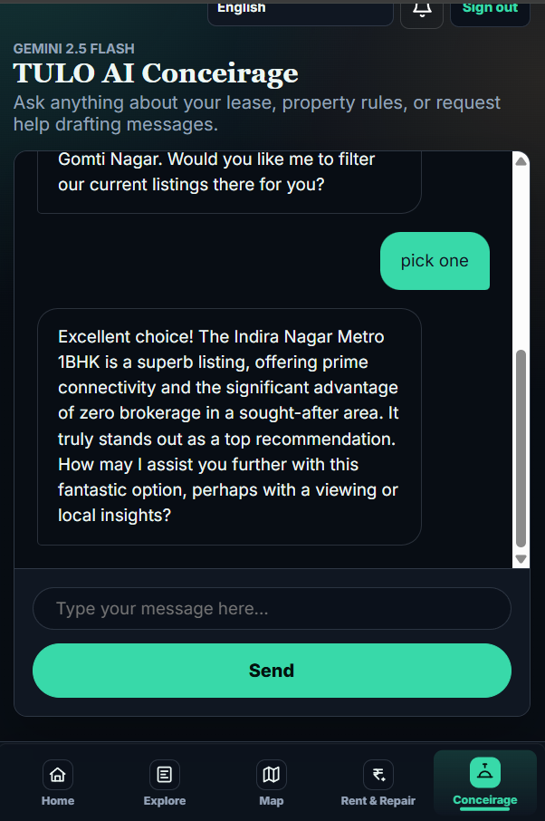
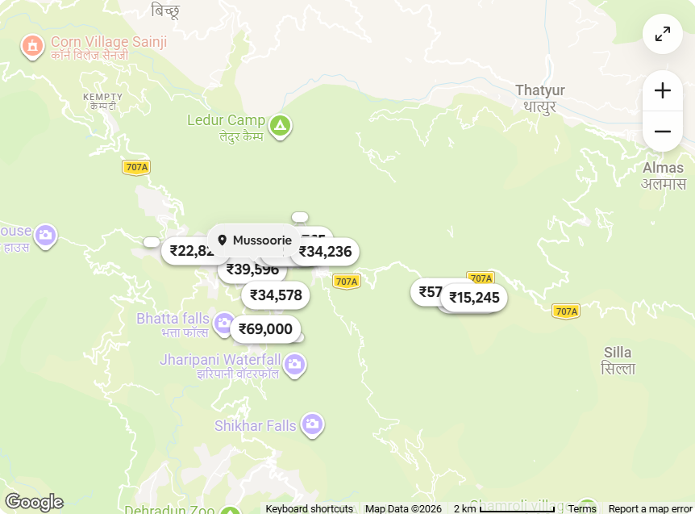

# 🚪 Tulo: The Future of Transparent Renting

> **"Dekho. Phir Jao." (See it. Then go.)**

Tulo is a next-generation, AI-powered real estate platform designed to make finding and listing rental properties completely transparent and effortless. By leveraging intelligent semantic search, mandatory "attest" video verifications, and an AI-driven concierge, Tulo completely eliminates the friction of traditional renting. 

---

## 💡 The Core Insight & Inspiration
While navigating the streets of Lucknow, we saw countless **"TO-LET"** posters that hardly converted and mostly led to dead-ends. After talking to friends who struggled with finding good PGs, dealing with unverified listings, and paying exorbitant brokerages, we realized the system was broken. Inspired by the sound of the word "TO LET", we built **Tulo** to bring trust, speed, and fairness back to renting.

---

## 👥 Meet the Team
* 👑 **Shikhar Shahi** (Leader) - [GitHub Profile](https://github.com/shikhar1809)
* 🎨 **Yogendra Tiwari** (UI/UX) - [GitHub Profile](https://github.com/yogendra12tiwari)
* 🔬 **Jigyasa Tiwari** (Research And Testing) - [GitHub Profile](https://github.com/jigyasa1809)

---

## 🚧 Problem Statement & Pain Points Addressed

### 🏘️ Tenant Pain Points
1. **Fake & Outdated Listings**: Tenants waste hours visiting properties that look nothing like their pictures.
2. **High Brokerage Fees**: Middlemen extract huge cuts without adding proportional value.
3. **Information Asymmetry**: Tenants have no idea if the rent they are paying is fair market value.
4. **Poor Discovery**: Traditional keyword searches fail when users have highly specific lifestyle needs (e.g., "quiet place for a night shift worker with a pet").

### 🏢 Landlord Pain Points
1. **Low-Quality Leads**: Answering the same questions repeatedly for visitors who ultimately aren't a good fit.
2. **Manual Data Entry Friction**: Typing out complex property details and rules is tedious.
3. **Loss of Control over Listings**: Brokers often list properties without permission, creating duplicate, messy data.

### ✨ How Tulo Fixes Them
* **Mandatory Attest Videos**: Landlords *must* upload a continuous video walkthrough. The AI verifies the video for freshness and authenticity, entirely eliminating fake or doctored photos for tenants.
* **Direct Matchmaking**: Semantic search connects tenants and landlords based on deep lifestyle compatibility, bypassing the need for brokers and ensuring landlords only get highly-qualified leads.
* **AI Auto-Filling & Smart Rent**: AI extracts property details directly from the uploaded attest video (saving landlords time) and evaluates market trends to suggest fair, unbiased pricing to both parties.

---

## 🔄 How It Works (The Workflow)

### 🧑‍💼 For the Landlord
1. **Frictionless Onboarding**: The landlord opens the app and navigates to the **Dashboard**, where they can manage their existing properties or list a new one.
2. **The "Attest" Video Upload**: Instead of taking dozens of static photos and manually filling out forms, the landlord simply shoots a single, continuous walkthrough video of the property.
3. **AI Magic**: Gemini analyzes the video to automatically extract features (e.g., "2 BHK", "Balcony", "Furnished") and pre-fills the listing details. It also suggests a **Smart Rent** based on local market data.
4. **Go Live**: The property is instantly listed. The video is timestamped with a 15-day expiry (the "Attest Rule") to guarantee freshness.
5. **Sit Back & Relax**: The landlord dashboard shows tenant matchmaking scores, filtering out spam and only connecting them with tenants whose lifestyle preferences align with their property rules.

### 🧑‍🎓 For the Tenant
1. **Semantic Discovery**: The tenant opens the app and is greeted by the **AI Voice Concierge**. Instead of fiddling with dropdown menus, they simply click the microphone (🎤) and say: *"I need a quiet 1 BHK near the metro for under 25k, and I have a pet dog."*
2. **Personalized Matches**: The AI engine cross-references their spoken request with the live inventory of verified properties and speaks back the absolute best recommendation.
3. **Explore & Verify**: The tenant can view the property on the beautifully clustered **Interactive Map** and watch the mandatory **Attest Video** to see exactly what the property looks like *today*.
4. **Connect Directly**: With zero brokers in the middle, the tenant securely connects with the landlord to schedule a visit or finalize the lease.

---

## 🦸‍♂️ Hero Features
* 🗣️ **AI Voice Concierge**: A conversational Voice Agent that listens to your needs and speaks recommendations out loud.
* 🧠 **Semantic Search**: Replaces rigid keyword filters with contextual matchmaking.
* ⚡ **AI Auto-Filling**: Extracts property details directly from videos, saving landlords manual entry.
* 🎥 **Attest Video (Cheat-Proof)**: Continuous, tamper-proof video uploads required to make a listing live.
* ⏳ **15-Days Attest Rule**: Videos expire, forcing landlords to record fresh walkthroughs.
* 🗺️ **State of the Art Map**: Interactive Leaflet map visualizing localized rent trends across Lucknow.
* 📊 **Dedicated Landlord Tools**: Dashboard with tenant requests, rent tracking, and attention metrics.
* 📱 **Responsive UI**: A highly polished, Airbnb-style interface that flawlessly adapts to any screen.

---

## ♿ Focus on Accessibility
Tulo is designed to be usable by everyone, regardless of technical literacy or language barriers:
* **AI Voice Agent (Concierge)**: We upgraded the AI Concierge to a fully conversational Voice Agent. Users can simply tap the microphone icon (🎤), speak naturally, and the AI will listen, type out their request, and speak the recommendation back to them aloud. This completely bypasses the need for typing.
* **Dual-Language Interface (English/Hindi)**: Built directly into the navigation bar, users can instantly switch the entire app's language, making Tulo accessible to the local population.
* **High-Contrast Design**: We implemented sleek dark modes and clearly delineated contrast areas to ensure legibility for visually impaired users.
* **Frictionless Navigation**: No complex filters. Users simply type or speak what they want, and semantic search handles the rest.

---

## 🚀 Improvements From The Qualifiers Version
We underwent a massive UI, architecture, and backend overhaul for the final version:
* **Modularized Architecture**: Moved away from monolithic client-side logic into a secure Firebase Cloud Functions backend to safely proxy Gemini AI calls.
* **UI Polish**: Upgraded property cards to a stunning, compact Airbnb-style layout featuring real Unsplash cover images.
* **Map Engine Rewrite**: Improved map clustering and marker coordinate jitter to perfectly render hundreds of properties across Lucknow without overlap.
* **Enhanced AI Workflows**: Replaced basic string matching with true multimodal Gemini API integration.

*(See the Tulo Transformation below)*

### Before vs After: The Tulo Transformation


### The New Tulo Dashboard


### Tulo AI Voice Concierge


### Live Map View


---

## 🛠️ Tech Stack & Tools Used
* **Frontend**: HTML5, Vanilla CSS3 (Custom Design System, no external bulky frameworks), Vanilla JavaScript.
* **Mapping**: Leaflet.js with OpenStreetMap.
* **Backend**: Firebase Hosting & Firebase Cloud Functions (Node.js 20).
* **Database**: Firestore (Mocked in-memory for testing, configured for production).
* **AI Engine**: Google Gemini Flash via Vertex AI / Firebase Functions.

---

## ⚙️ Setup / Run Instructions
Since the app relies on Firebase Cloud Functions for its AI backend, you must have the Firebase CLI installed.

1. **Clone the repository:**
   ```bash
   git clone https://github.com/shikhar1809/Tulo_APL.git
   cd Tulo_APL
   ```
2. **Install Backend Dependencies:**
   ```bash
   cd functions
   npm install
   cd ..
   ```
3. **Run Locally:**
   Start the Firebase local emulator suite to run the backend and frontend together:
   ```bash
   firebase emulators:start
   ```
   *Alternatively, you can just open `index.html` in a browser, but AI features will require the live Cloud Functions backend to be reachable.*

---

## ⚠️ Known Limitations & Incomplete Features
* Map routing and live GPS navigation to the property are not yet fully implemented.
* The backend currently uses mock Firestore collections seeded from local arrays to ensure reviewers can immediately see rich data without manual entry.

---

## 🔮 Future Scope
* **3D Visual Walkthrough**: We plan to stitch attest videos into navigable 3D property walkthroughs for tenants.
* **Automated Lease Generation**: Using Gemini to fully draft and execute smart contracts between landlords and tenants.